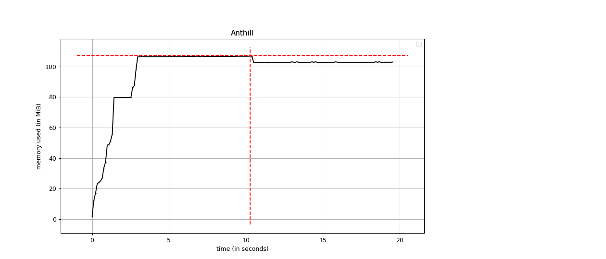

# QUA - semestrální práce

Kód pochází ze semestrální práce z předmětu BI-PYT. (https://gitlab.fit.cvut.cz/menclpet/pyt-semestral)

Práce obsahovala pár unittestů, které ale nepodléhaly testovacím konvencím.
Ty jsou tedy přepsané a doplněné o spoustu dalších. 

### Jaké testy psát? </br>
Aplikace obsahuje primitivní rozhraní pro tvorbu map, které je volně přístupné 'pro veřejnost', proto by mělo být intenzivně testováno.</br>
Co se týká vykreslování a grafického rozhraní, knihovna PyGame je zastaralá a sama o sobě ne bezchybná, tedy testování modulů, které s ní přímo pracují je krajně nemožné, proto je mu věnováno méně prostoru.
</br>
Obecně hlavním polířem her je mechanika, pokud se špatně vykreslí mravenec, to uživatel zkousne, pokud přijde bezdůvodně o mraveniště nebo hra na konci spadne, to už ne, proto by oblast kódu zaměřená na mechaniku hry měla být nejdůkladněji testována.

### Testy
Testy jsou umístěné v složce oddělené od zdrojového kódu hry v **./test/**, kde jsou rozdělené do jednotlivých sad, které se zaměřují na jednotlivé oblasti hry. </br>
Testy jsou také "tagované", tedy jde také například vyloučit/zvolit testy GUI, které jsou pomalé kvůli tvorbě okna.

### Pokrytí

Pokrytí testů není z výše zmíněných důvodů 100%.
```
Name                    Stmts   Miss  Cover
-------------------------------------------
GUI\__init__.py             0      0   100%
GUI\button_manager.py      55      3    95%
GUI\gui_manager.py        147     86    41%
game.py                   159     54    66%
main.py                   130     50    62%
map_creator.py             33     33     0%
model\__init__.py           0      0   100%
model\ant.py                9      0   100%
model\anthill.py           70      4    94%
model\color.py             15      0   100%
model\gameState.py         11      0   100%
model\map.py              118     35    70%
model\map_elem.py           7      0   100%
model\player.py            19      0   100%
tests\__init__.py           0      0   100%
tests\test_GUI.py          79      0   100%
tests\test_anthill.py     125      6    95%
tests\test_game.py        132      0   100%
tests\test_main.py         13      0   100%
tests\test_map.py         120      1    99%
tests\test_player.py       35      0   100%
tests\test_utils.py        27      0   100%
utils.py                   31      2    94%
-------------------------------------------
TOTAL                    1335    274    79%
```

### Výstupy
Soubor **./reports/pytest_output.txt** obsahuje výstup pytestu po dopsání většiny testů, kde je vidět, že odhalil neohlídané vstupy ve funkcích třídy *Map*. Jako součást procesu jsem chyby SW průběžně opravoval, abych došel do stavu, kdy splňuje všechny testy.</br>
V souboru **./reposrts/pylint_output.txt** je výstup linteru, tedy statické analázy původního kódu.

### Memory Profiler
    mprof run ./main.py
    mprof plot

Uložený graf v **./reports/memory_profiler.png**


### Linter
    pylint --recursive y ./

### Test
    pytest
    pytest -m "not gui"
    pytest -m "not gui" --cov=./